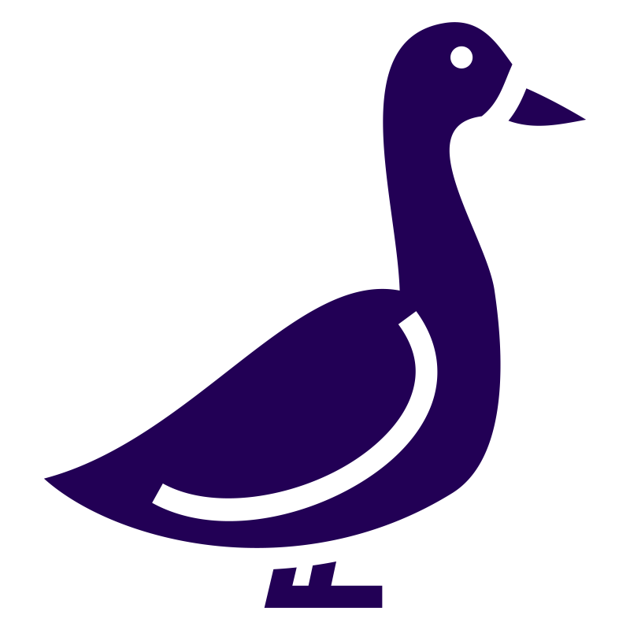

<div align="center">
  <picture>
    
  </picture>
<br>

<h2>Gaggle</h2>

[](https://github.com/CogitatorTech/gaggle/actions/workflows/tests.yml)
[](https://www.codefactor.io/repository/github/CogitatorTech/gaggle)
[](https://github.com/CogitatorTech/gaggle/tree/main/docs/examples)
[](https://github.com/CogitatorTech/gaggle/tree/main/docs)
[](https://github.com/CogitatorTech/gaggle)

Kaggle Datasets for DuckDB

</div>

---

Gaggle is a DuckDB extension that allows you to read and write Kaggle datasets directly in SQL queries,
treating them as if they were regular DuckDB tables. It is developed in Rust and provides seamless integration
with the Kaggle API for dataset discovery, download, and management.

### Motivation

Data scientists and analysts often need to work with datasets from Kaggle. The traditional workflow involves:
1. Manually downloading datasets from Kaggle's website
2. Extracting ZIP files
3. Loading CSV/Parquet files into your analysis environment
4. Managing storage and updates

Gaggle simplifies this workflow by integrating Kaggle datasets directly into DuckDB. You can:
- Query Kaggle datasets as if they were local tables
- Search and discover datasets without leaving SQL
- Automatically cache datasets locally for fast access
- Manage dataset versions and updates

### Features

- **Direct SQL access** to Kaggle datasets with `SELECT * FROM 'kaggle:owner/dataset/file.csv'`
- **Search datasets** using `gaggle_search('query')`
- **Download and cache** datasets automatically
- **List files** in datasets before loading
- **Get metadata** about datasets including size, description, and update info
- **Credential management** via environment variables, config file, or SQL
- **Automatic caching** for fast repeated access
- Thread-safe and memory-efficient

### Quick Start

```sql
-- Set your Kaggle credentials (or use ~/.kaggle/kaggle.json)
SELECT gaggle_set_credentials('your-username', 'your-api-key');

-- Search for datasets
SELECT * FROM json_each(gaggle_search('covid-19', 1, 10));

-- Read a Kaggle dataset directly
SELECT * FROM 'kaggle:owid/covid-latest-data/owid-covid-latest.csv' LIMIT 10;

-- Download and get local path
SELECT gaggle_download('owid/covid-latest-data');

-- List files in a dataset
SELECT * FROM json_each(gaggle_list_files('owid/covid-latest-data'));

-- Get dataset metadata
SELECT * FROM json_each(gaggle_info('owid/covid-latest-data'));
```

### API Functions

| Function | Description |
|----------|-------------|
| `gaggle_set_credentials(username, key)` | Set Kaggle API credentials |
| `gaggle_search(query, page, page_size)` | Search for datasets on Kaggle |
| `gaggle_download(dataset_path)` | Download a dataset and return local path |
| `gaggle_list_files(dataset_path)` | List files in a dataset (JSON array) |
| `gaggle_info(dataset_path)` | Get dataset metadata (JSON object) |
| `gaggle_get_version()` | Get extension version info |
| `gaggle_clear_cache()` | Clear the local dataset cache |
| `gaggle_get_cache_info()` | Get cache statistics |

### Configuration

Gaggle can be configured via environment variables:

- `KAGGLE_USERNAME` - Your Kaggle username
- `KAGGLE_KEY` - Your Kaggle API key
- `GAGGLE_CACHE_DIR` - Directory for caching datasets (default: system cache dir)
- `GAGGLE_VERBOSE` - Enable verbose logging (default: false)
- `GAGGLE_HTTP_TIMEOUT` - HTTP timeout in seconds (default: 30)

Alternatively, create `~/.kaggle/kaggle.json`:
```json
{
  "username": "your-username",
  "key": "your-api-key"
}
```

See the [ROADMAP.md](ROADMAP.md) for planned features and the [docs](docs/) folder for detailed documentation.

> [!IMPORTANT]
> Gaggle is in early development, so bugs and breaking changes are expected.
> Please use the [issues page](https://github.com/CogitatorTech/gaggle/issues) to report bugs or request features.

---

### Quickstart

#### Install from Community Extensions Repository

You can install and load Gaggle from
the [DuckDB community extensions](https://duckdb.org/community_extensions/extensions/gaggle) repository by running the
following SQL commands in the DuckDB shell:

```sql
install gaggle from community;
load gaggle;
```

#### Build from Source

Alternatively, you can build Gaggle from source and use it by following these steps:

1. Clone the repository and build the Gaggle extension from source:

```bash
git clone --recursive https://github.com/CogitatorTech/gaggle.git
cd gaggle

# This might take a while to run
make release
```

2. Start DuckDB shell (with Gaggle statically linked to it):

```bash
./build/release/duckdb
```

> [!NOTE]
> After building from source, the Gaggle binary will be `build/release/extension/gaggle/gaggle.duckdb_extension`.
> You can load it using the `load 'build/release/extension/gaggle/gaggle.duckdb_extension';` in the DuckDB shell.
> Note that the extension binary will only work with the DuckDB version that it was built against.
> You can download the pre-built binaries from the [releases page](https://github.com/CogitatorTech/gaggle/releases) for
> your platform.


#### Trying Gaggle

```sql
-- 0. Install and load Gaggle 
-- Skip this step if you built from source and ran `./build/release/duckdb`
install gaggle from community;
load gaggle;

-- 1. Load a simple linear model from a remote URL
select gaggle_load_model('linear_model',
                         'https://github.com/CogitatorTech/gaggle/raw/refs/heads/main/test/models/linear.onnx');

-- 2. Run a prediction using a very simple linear model
-- Model: y = 2*x1 - 1*x2 + 0.5*x3 + 0.25
select gaggle_predict('linear_model', 1.0, 2.0, 3.0);
-- Expected output: 1.75

-- 3. Unload the model when we're done with it
select gaggle_unload_model('linear_model');

-- 4. Check the Gaggle version
select gaggle_get_version();
```

[](https://asciinema.org/a/745806)

---

### Documentation

Check out the [docs](docs/README.md) directory for the API documentation, how to build Gaggle from source, and more.

#### Examples

Check out the [examples](docs/examples) directory for SQL scripts that show how to use Gaggle.

---

### Contributing

See [CONTRIBUTING.md](CONTRIBUTING.md) for details on how to make a contribution.

### License

Gaggle is available under either of the following licenses:

* MIT License ([LICENSE-MIT](LICENSE-MIT))
* Apache License, Version 2.0 ([LICENSE-APACHE](LICENSE-APACHE))

### Acknowledgements

* The logo is from [here](https://www.svgrepo.com/svg/322445/goose) with some modifications.
